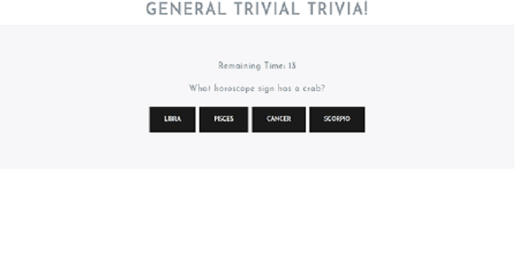

# TriviaGame

## A simple game using JavaScript for the logic and jQuery to manipulate HTML

## Overview

- The game shows one question until the player answers it or their time runs out

- If the player selects the correct answer, show a screen congratulating them for choosing the right
  option. After a few seconds, display the next question -- do this without user input.

- The scenario is similar for wrong answers and time-outs.

- If the player runs out of time, it tells the player that time's up and display the correct answer. It shows the next question few seconds later.

  - If the player chooses the wrong answer, it tell the player they selected the wrong option and then display the correct answer.

- On the final screen, It shows number of correct answers, incorrect answers, and an option to restart the game (without reloading the page).
